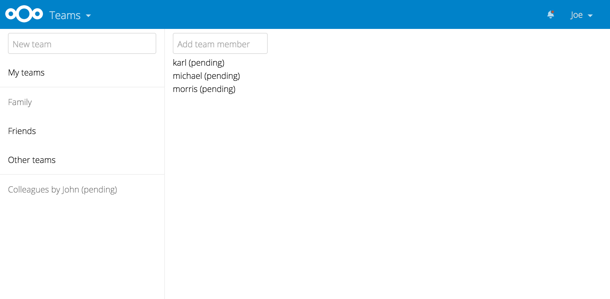

# Circles

Circles allows your users to create their own groups of users/colleagues/friends. 
Those groups of users (or circles) can then be used by any other app for sharing purpose 
(files, social feed, status update, messaging, ...) 

Differents type of circles can be created:

- 'hidden' provides no interaction with peoples in the circles. An 'hidden' circle is just 
a private shortcut if you wish to quickly share with a list of cloudusers. Other people from the circle 
won't be able to interact/share with you or to each other. However, they can choose to leave/block it.
- 'society' allow everyone invited in the circle to interact with each others, within the limits of their 
level. (admin, moderator, guest).
It's based on an invitation concept and requests could be initiated from both sides:
user and circle admin needs to mutually accept membership before shares to a circle show up for the clouduser.

### Credits

App Icon by [http://www.flaticon.com/authors/madebyoliver](Madebyoliver) under Creative Commons BY 3.0